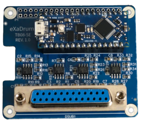

# Exadrumino Nano Every

Arduino Nano Every Trigger Module.

## Description

Exadrumino Nano Every is a C++ program that has been written especially for the Arduino Nano Every and allows to play drums using the appropriate software.

It is a high performance firmware that allows to read eight analog inputs very fast and send MIDI notes over USB, or via the on-board USART.
Using the right piezo voltage conditionning board and a PC loaded with a VST, it allows to play drums with a very low latency.

## Features

- Works on PC and Raspberry Pi.
- Compatible with Roland e-drums TD-9, TD-11, TD-15, TD-17, TD-25, and TD-27.
- Up to 7 single-zone pads + 1 hi-hat controller.
- Customizable threshold, scan time, mask time and MIDI notes (to be implemented).
- Save settings to on-board EEPROM (to be implemented).
- Serial MIDI using TX/RX pins or USB.

## Requirements

You need an Arduino Nano Every and a PC to flash the code to the Arduino.
The board cannot be connected to piezo sensors directly, you need to use a piezo voltage conditioning board.

It is recommend to use the official board, but any board can work as long as it is wired to the Arduino correctly.

To use the trigger module, you'll either need a PC, a Raspberry Pi or a similar device.

## How to Use

### How to Flash the Arduino

### How to Use With a PC

If you wish to use the trigger module with a PC, you are going to need a micro-USB cable to connect to the Arduino.

#### Linux

#### Mac

#### Windows

### How to Use With a Raspberry Pi

You don't necessarily need to solder a 40x2 pin socket to the board. Instead you can use "Fitting hammer headers" such as those that can be found at [Pimoroni](https://shop.pimoroni.com/search?q=hammer).

## How it Works
